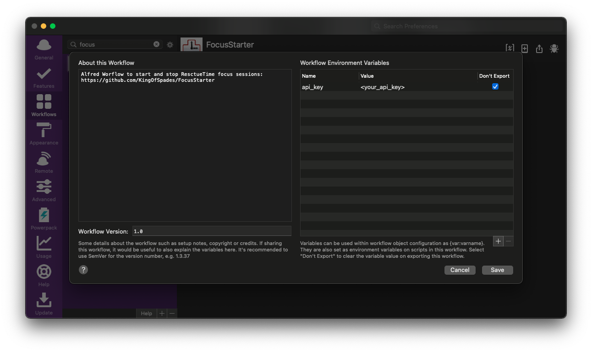

# FocusStarter
Alfred Workflow to start and stop RescueTime sessions. Relies on the RescueTime API documented here [RescueTime API](https://www.rescuetime.com/apidoc). Compatible with Alfred 4 (and older versions)

# Demo
## Start Session
Use `focus` + `time in minutes`. Example: `focus 5` to start a 5 minute focus session:

## Stop Session:
Use `focus stop` to stop any active Focus session.

# Setup
Import the worflow and enter you API Token during setup or on the Variable screen:

# Notes
At this point you will get an extra notification from RescueTime. This might be a bit later then your inital Focus starter because the App on desktop wil only check de online status once every minute.

# ToDo
- [ ] Add option to trigger DND on MacOS

# Was this helpfull?
Did you find any of this usefull? Consider buying me a coffe over at [BuyMeACoffee](https://www.buymeacoffee.com/cabenstein)

